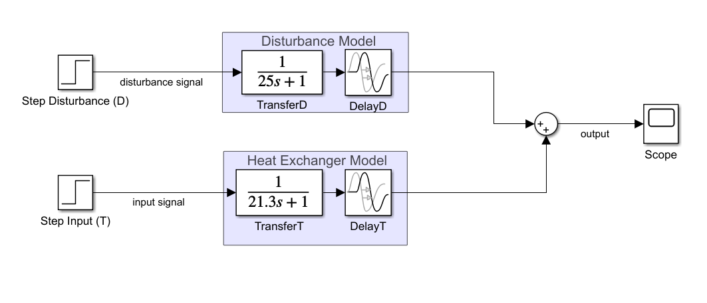
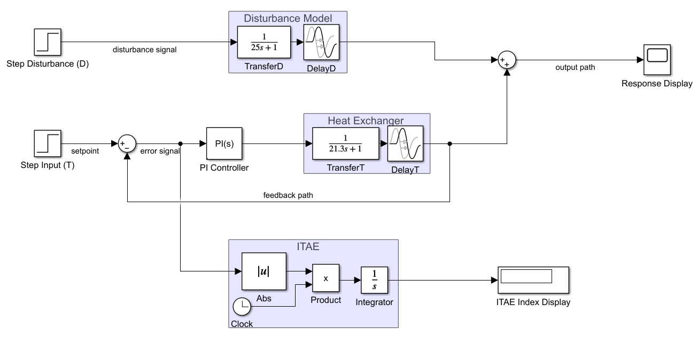
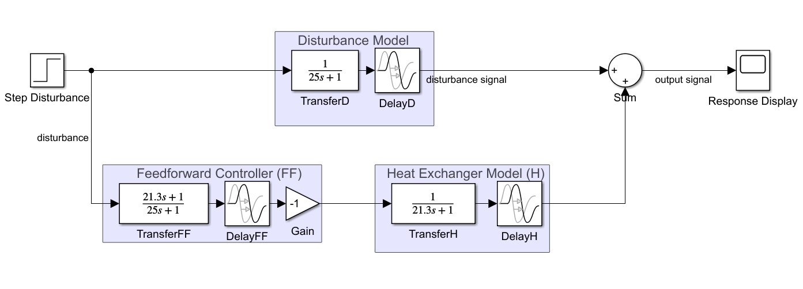
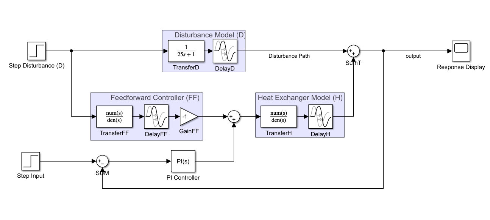
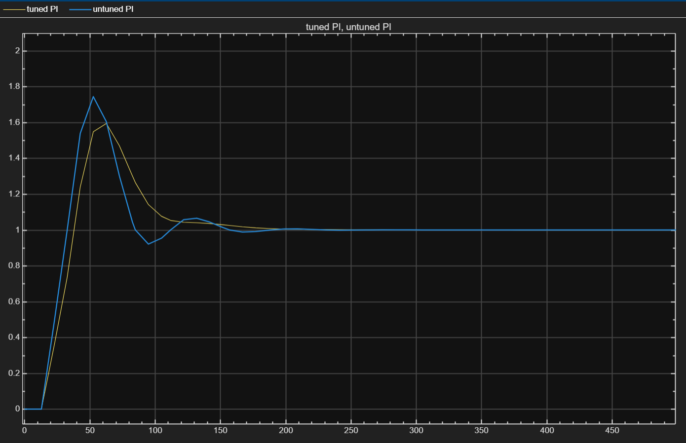
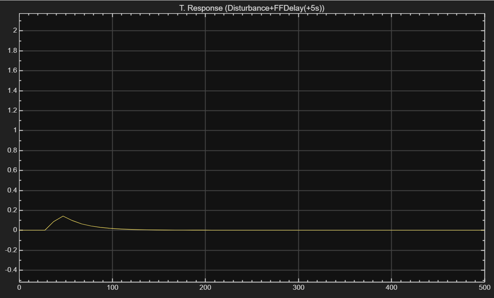
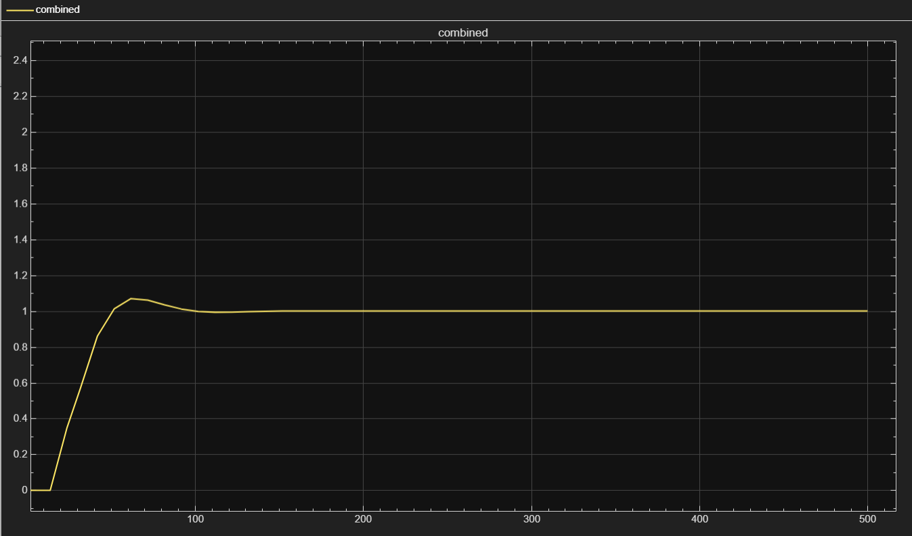
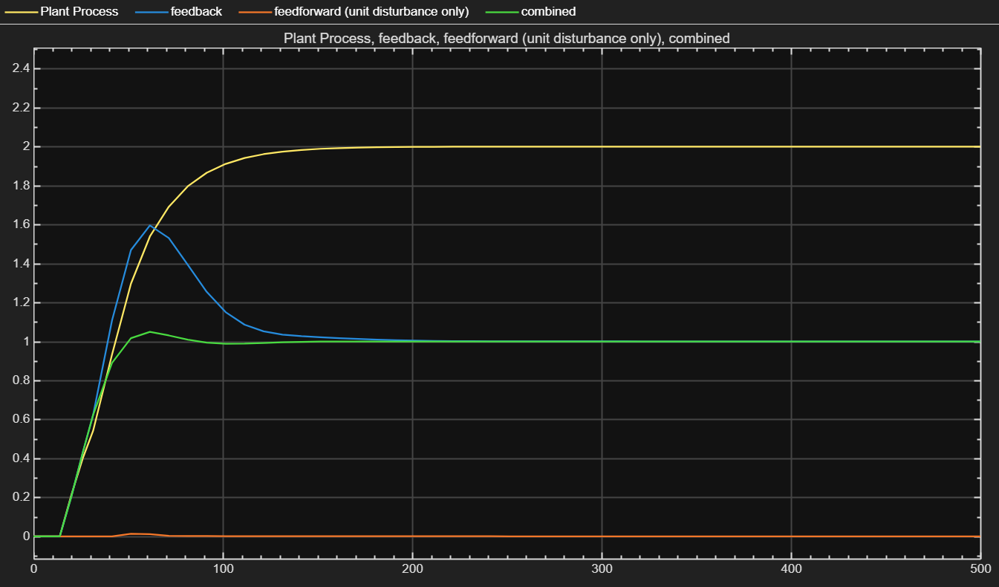

# heat-exchanger-temp-control

# Heat Exchanger Temperature Control (Simulink)
Model-based temperature control design for a heat exchanger using:
- Open-loop FOPDT + dead time modelling
- PI feedback control (tuned vs untuned comparison)
- Feedforward disturbance compensation (delay sensitivity study)
- Combined Feedforward + Feedback architecture (industry-style solution)

> Built and simulated in MATLAB/Simulink R2025b.

---

## 1) System Model
The process is modelled as first-order plus dead time (FOPDT) for both the plant and disturbance path.

- Plant (temperature path):  Gp(s) = 1 / (21.3 s + 1) with delay
- Disturbance path:          Gd(s) = 1 / (25 s + 1) with delay

---

## 2) Control Architectures Implemented
### A) PI Feedback Control
PI controller tuned to improve setpoint tracking and reduce steady-state error.
Includes ITAE performance index computation for objective comparison.

### B) Feedforward Disturbance Compensation
Feedforward designed to cancel measured disturbance influence through model inversion/ratio and delay alignment.

### C) Combined Feedforward + Feedback
Feedforward handles predictable disturbance effects; feedback corrects model mismatch and unmeasured disturbances.

---

## 3) Key Results (Plots)
### Open-loop response

### Tuned vs Untuned PI

### Feedforward delay sensitivity (20.3s vs 25.3s)

### Combined control response

### Comparison: plant vs feedback vs feedforward vs combined

---

## 4) How to Run
1. Open the Simulink models in `/sim`
2. Run simulations and view scopes/plots
3. (Optional) Export plots to `/docs/media` for documentation

**Requirements**
- MATLAB R2025b
- Simulink
- Control System Toolbox (recommended)

---

## 5) Documentation
- Model details: docs/model.md  
- Control design notes: docs/control_design.md  
- Results and discussion: docs/results.md  
- Full report PDF: report/IPC_assignment_Hakeem.pdf
