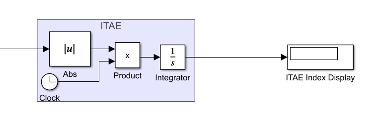

# Control Design

This section documents the design logic behind the three controller strategies: PI feedback, feedforward disturbance compensation, and the combined FF+FB architecture.

---

## 1) PI Feedback control

### Structure
Feedback control compares the setpoint \(r(t)\) to the measured output \(y(t)\) to generate an error:

\[
e(t) = r(t) - y(t)
\]

A PI controller is applied:

\[
C(s) = K_p\left(1 + \frac{1}{T_i s}\right)
\]

The manipulated input to the plant is then:

\[
u(s) = C(s)\,e(s)
\]

### Why PI is appropriate here
For temperature loops:
- proportional action increases response speed
- integral action removes steady-state error from disturbances and model bias
- derivative action is often avoided in noisy or delayed thermal processes (and PI is industrially common)

### ITAE performance index (objective metric)
To quantify performance, the **Integral of Time-weighted Absolute Error (ITAE)** was implemented in Simulink:

\[
J_{\mathrm{ITAE}} = \int_0^{T} t\,|e(t)|\,dt
\]

This penalizes errors that persist longer (late errors cost more), encouraging good settling behavior.

Simulink implementation (Abs + Clock + Product + Integrator):

---

## 2) Feedforward disturbance compensation

### Concept
If the disturbance \(d(t)\) is measured or known, feedforward can cancel its effect before the output deviates significantly.

The output contribution of disturbance is:

\[
y_d(s) = G_d(s)\,d(s)
\]

If we inject a compensating control \(u_{ff}(s) = G_{ff}(s)\,d(s)\) into the plant input, its output contribution is:

\[
y_{ff}(s) = G_p(s)\,u_{ff}(s) = G_p(s)\,G_{ff}(s)\,d(s)
\]

We want cancellation:

\[
G_p(s)\,G_{ff}(s) + G_d(s) \approx 0
\Rightarrow
G_{ff}(s) \approx -\frac{G_d(s)}{G_p(s)}
\]

Given the model blocks in your Simulink design (unity gains), the feedforward transfer you used matches the expected ratio form:

\[
G_{ff}(s) = -\frac{21.3s + 1}{25s + 1}\,e^{-(L_d - L_p)s}
\]

- The **minus sign** provides cancellation (implemented with a `-1` gain).
- The **delay term** handles dead-time alignment (implemented via `DelayFF`).

Simulink implementation:

### Why feedforward delay matters
Dead time mismatch causes imperfect cancellation. Your delay sweep shows that small differences in feedforward delay change the residual “bump” in the output during disturbance compensation.

---

## 3) Combined Feedforward + Feedback

### Structure
The combined strategy sums feedforward and feedback actions into the plant input:

\[
u(s) = u_{fb}(s) + u_{ff}(s) = C(s)e(s) + G_{ff}(s)d(s)
\]

Where:
- feedforward removes predictable disturbance effects
- feedback ensures robustness: corrects model mismatch, handles unmeasured disturbances, and eliminates residual steady-state error

Simulink implementation:

### Why combined control is preferred in practice
Pure feedforward is only as good as the model and measured disturbance signal. Pure feedback can reject disturbances but typically *after* the output deviates. Combining both yields a practical best of both worlds: early compensation + robust correction.
